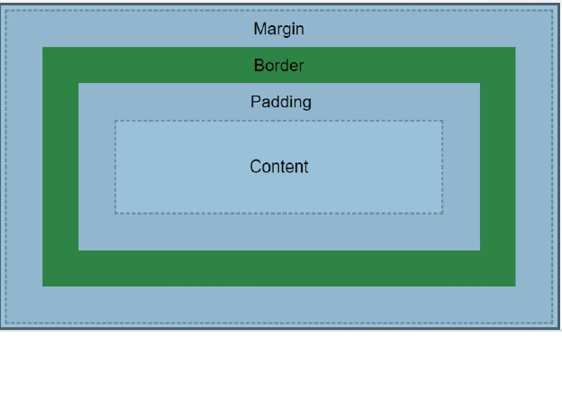

# Utilización de lenguajes de marcas en entornos web

- [Utilización de lenguajes de marcas en entornos web](#utilización-de-lenguajes-de-marcas-en-entornos-web)
  - [1. Estándares web. Versiones. Clasificación](#1-estándares-web-versiones-clasificación)
    - [1.1. ¿Qué son los estándares web?](#11-qué-son-los-estándares-web)
    - [1.2. World Wide Web Consortium (W3C)](#12-world-wide-web-consortium-w3c)
    - [1.3. Clasificación de estándares web](#13-clasificación-de-estándares-web)
      - [**Estructura y contenido**](#estructura-y-contenido)
      - [**Presentación**](#presentación)
      - [**Comportamiento**](#comportamiento)
      - [**Accesibilidad**](#accesibilidad)
    - [1.4. Versiones de HTML](#14-versiones-de-html)
    - [1.5. Versiones de CSS](#15-versiones-de-css)
  - [2. Estructura de un documento HTML](#2-estructura-de-un-documento-html)
    - [2.1. Estructura básica](#21-estructura-básica)
    - [2.2. DOCTYPE - ENCABEZADO](#22-doctype---encabezado)
    - [2.3. Elemento HTML](#23-elemento-html)
    - [2.4. Elemento HEAD](#24-elemento-head)
    - [2.5. Elemento BODY](#25-elemento-body)
  - [3. Identificación de etiquetas y atributos de HTML](#3-identificación-de-etiquetas-y-atributos-de-html)
    - [3.1. Etiquetas básicas de estructura](#31-etiquetas-básicas-de-estructura)
      - [**Elementos semánticos HTML5**](#elementos-semánticos-html5)
      - [**Elementos de agrupación**](#elementos-de-agrupación)
    - [3.2. Etiquetas de contenido textual](#32-etiquetas-de-contenido-textual)
      - [**Encabezados**](#encabezados)
      - [**Formato de texto**](#formato-de-texto)
      - [**Listas**](#listas)
    - [3.3. Etiquetas para multimedia](#33-etiquetas-para-multimedia)
      - [**Imágenes**](#imágenes)
      - [**Audio y video**](#audio-y-video)
      - [**Enlaces**](#enlaces)
    - [3.4. Etiquetas para formularios](#34-etiquetas-para-formularios)
    - [3.5. Atributos globales](#35-atributos-globales)
    - [3.6. Atributos específicos](#36-atributos-específicos)
      - [**Atributos de formularios**](#atributos-de-formularios)
      - [**Atributos de multimedia**](#atributos-de-multimedia)
      - [**Atributos de enlaces**](#atributos-de-enlaces)
  - [4. Herramientas de diseño web](#4-herramientas-de-diseño-web)
    - [4.1. Editores de código](#41-editores-de-código)
      - [**Visual Studio Code**](#visual-studio-code)
      - [**Sublime Text**](#sublime-text)
    - [4.2. Navegadores y herramientas de desarrollo](#42-navegadores-y-herramientas-de-desarrollo)
      - [**Chrome DevTools**](#chrome-devtools)
      - [**Firefox Developer Tools**](#firefox-developer-tools)
      - [**Safari Web Inspector**](#safari-web-inspector)
    - [4.3. Frameworks y librerías](#43-frameworks-y-librerías)
      - [**CSS Frameworks**](#css-frameworks)
      - [**JavaScript Frameworks**](#javascript-frameworks)
    - [4.4. Herramientas de diseño visual](#44-herramientas-de-diseño-visual)
      - [**Figma**](#figma)
      - [**Adobe XD**](#adobe-xd)
      - [**Sketch** (Solo macOS)](#sketch-solo-macos)
  - [5. Hojas de estilo (CSS)](#5-hojas-de-estilo-css)
    - [5.1. ¿Qué es CSS?](#51-qué-es-css)
    - [5.2. Formas de aplicar CSS](#52-formas-de-aplicar-css)
      - [**CSS Inline (En línea)**](#css-inline-en-línea)
      - [**CSS Interno**](#css-interno)
      - [**CSS Externo** (Recomendado)](#css-externo-recomendado)
    - [5.3. Selectores CSS](#53-selectores-css)
      - [**Selectores básicos**](#selectores-básicos)
        - [selector de elemento](#selector-de-elemento)
        - [selector de clase](#selector-de-clase)
        - [selector de identificador (ID)](#selector-de-identificador-id)
      - [**Selector universal**](#selector-universal)
      - [**Selectores de atributo**](#selectores-de-atributo)
      - [**Selectores de combinación**](#selectores-de-combinación)
      - [**Pseudo-clases**](#pseudo-clases)
      - [**Pseudo-elementos**](#pseudo-elementos)
    - [5.4. Propiedades principales](#54-propiedades-principales)
      - [Unidades y medidas](#unidades-y-medidas)
      - [**Tipografía**](#tipografía)
      - [**Colores y fondos**](#colores-y-fondos)
      - [**Espaciado**](#espaciado)
      - [**propiedades personalizadas (variables CSS)**](#propiedades-personalizadas-variables-css)
    - [5.5. Modelo de caja (Box Model)](#55-modelo-de-caja-box-model)
    - [5.6. Flexbox y Grid](#56-flexbox-y-grid)
      - [**Flexbox (Diseño flexible)**](#flexbox-diseño-flexible)
      - [**Grid (Rejilla)**](#grid-rejilla)
    - [5.7. Media querys](#57-media-querys)
  - [6. Validación de documentos HTML y CSS](#6-validación-de-documentos-html-y-css)
    - [6.1. ¿Por qué validar?](#61-por-qué-validar)
    - [6.2. Validador HTML del W3C](#62-validador-html-del-w3c)
      - [**Acceso al validador**](#acceso-al-validador)
      - [**Tipos de errores comunes**](#tipos-de-errores-comunes)
      - [**Advertencias vs Errores**](#advertencias-vs-errores)
    - [6.3. Validador CSS del W3C](#63-validador-css-del-w3c)
      - [**Acceso al validador**](#acceso-al-validador-1)
      - [**Errores CSS comunes**](#errores-css-comunes)
    - [6.4. Herramientas de validación automática](#64-herramientas-de-validación-automática)
      - [**Extensiones de VS Code**](#extensiones-de-vs-code)
  - [7. Lenguajes de marcas para la sindicación de contenidos](#7-lenguajes-de-marcas-para-la-sindicación-de-contenidos)
    - [7.1. ¿Qué es la sindicación de contenidos?](#71-qué-es-la-sindicación-de-contenidos)
    - [7.2. RSS (Really Simple Syndication)](#72-rss-really-simple-syndication)
      - [**Estructura básica de RSS**](#estructura-básica-de-rss)
      - [**Elementos principales de RSS**](#elementos-principales-de-rss)
    - [7.3. Atom](#73-atom)
      - [**Estructura básica de Atom**](#estructura-básica-de-atom)
      - [**Ventajas de Atom sobre RSS**](#ventajas-de-atom-sobre-rss)
    - [7.4. JSON Feed](#74-json-feed)
      - [**Estructura de JSON Feed**](#estructura-de-json-feed)
    - [7.5. Comparación de formatos](#75-comparación-de-formatos)
      - [**Cuándo usar cada formato**](#cuándo-usar-cada-formato)
  - [8. Referencias](#8-referencias)
    - [**Documentación oficial**](#documentación-oficial)
    - [**Herramientas de validación**](#herramientas-de-validación)
    - [**Recursos de aprendizaje**](#recursos-de-aprendizaje)
    - [**Herramientas de desarrollo**](#herramientas-de-desarrollo)
    - [**Sindicación de contenidos**](#sindicación-de-contenidos)


## 1. Estándares web. Versiones. Clasificación

### 1.1. ¿Qué son los estándares web?

Los **estándares web** son un conjunto de especificaciones técnicas y recomendaciones que definen cómo debe funcionar `la World Wide Web`. Estos estándares aseguran que las páginas web funcionen de manera consistente en `diferentes navegadores` y `dispositivos`.

**Objetivos principales:**
- **Interoperabilidad**: Las páginas web funcionan igual en todos los navegadores
- **Accesibilidad**: Contenido accesible para personas con discapacidades
- **Mantenibilidad**: Código más fácil de mantener y actualizar
- **Futuro-compatibilidad**: Preparación para futuras tecnologías

### 1.2. World Wide Web Consortium (W3C)

El **W3C** es la organización internacional que desarrolla los estándares web. Fundada en 1994 por Tim Berners-Lee, es responsable de:

- Especificaciones de HTML
- Especificaciones de CSS
- Estándares de accesibilidad [WCAG](https://guia-wcag.com/es/)
- Protocolos web
- APIs web

### 1.3. Clasificación de estándares web

Los estándares web se clasifican en diferentes categorías:

#### **Estructura y contenido**
- **HTML**: HyperText Markup Language - Lenguaje de marcado para estructura
- **XML**: Lenguaje extensible de marcado

#### **Presentación**
- **CSS**: Hojas de estilo en cascada
- **SVG**: Gráficos vectoriales escalables

#### **Comportamiento**
- **JavaScript**: Lenguaje de programación
- **DOM**: Modelo de objetos del documento
- **APIs web**: Interfaces de programación

#### **Accesibilidad**
- **WCAG**: Pautas de accesibilidad
- **ARIA**: Aplicaciones ricas accesibles

### 1.4. Versiones de HTML

| Versión | Año | Características principales |
|---------|-----|---------------------------|
| HTML 1.0 | 1993 | Primera versión básica |
| HTML 2.0 | 1995 | Formularios, tablas básicas |
| HTML 3.2 | 1997 | Tablas mejoradas, applets |
| HTML 4.0 | 1997 | CSS, JavaScript, internacionalización |
| HTML 4.01 | 1999 | Corrección de errores de 4.0 |
| XHTML 1.0 | 2000 | HTML reformulado como XML |
| HTML5 | 2014 | Elementos semánticos, multimedia, APIs |
| HTML 5.1 | 2016 | Nuevos elementos y atributos |
| HTML 5.2 | 2017 | Mejoras en formularios y elementos |

### 1.5. Versiones de CSS

| Versión | Año | Características principales |
|---------|-----|---------------------------|
| CSS 1 | 1996 | Propiedades básicas de estilo |
| CSS 2 | 1998 | Posicionamiento, medios |
| CSS 2.1 | 2004 | Correcciones y clarificaciones |
| CSS 3 | 2012+ | Módulos independientes, animaciones |
| CSS 4 | En desarrollo | Selectores avanzados, variables |


## 2. Estructura de un documento HTML
El **HTML** es un lenguaje de marcas por lo que debe cumplir con las mismas restricciones que hemos visto en **XML**, la principal diferencia con XML es que en HTML el número de etiquetas disponibles son limitadas y además están ya definidas (no podemos usar ninguna que no pertenezca ya a este lenguaje).

Por otro lado, los tipos que hay son los mismos. Tenemos etiquetas de apertura, etiquetas de cierre, etiquetas vacías y atributos, que deben cumplir con las características de todos los lenguajes de marcas.

**HTML** es un estándar desarrollado por [W3C (World Wide Web Consortium)](https://html.spec.whatwg.org/multipage/).

### 2.1. Estructura básica

Un documento HTML tiene una estructura jerárquica bien definida:

```html
<!DOCTYPE html>
<html lang="es">
<head>
    <meta charset="UTF-8">
    <meta name="viewport" content="width=device-width, initial-scale=1.0">
    <title>Título de la página</title>
</head>
<body>
    <h1>Contenido principal</h1>
    <p>Párrafo de ejemplo</p>
</body>
</html>
```

### 2.2. DOCTYPE - ENCABEZADO

La declaración `<!DOCTYPE>` informa al navegador sobre la versión de HTML utilizada:

```html
<!DOCTYPE html>  <!-- HTML5 -->
<!DOCTYPE HTML PUBLIC "-//W3C//DTD HTML 4.01//EN"> <!-- HTML 4.01 -->
```

### 2.3. Elemento HTML

El elemento `<html>` es la raíz del documento. Es obligatoria para poder formar el documento. Se compone de una etiqueta de apertura y otra de cierre y entre ambas incluiremos el resto del documento.

```html
<html lang="es">
    <!-- Todo el contenido va aquí -->
</html>
```

**Atributos importantes:**
- `lang`: Idioma principal del documento
- `dir`: Dirección del texto (ltr, rtl)

### 2.4. Elemento HEAD
Esta etiqueta es obligatoria dentro de todo documento HTML, contiene información sobre el título de la página, el autor, el idioma, etc.
Es obligatorio definir el título del documento.
La información que definamos dentro de esta etiqueta no se mostrará en el navegador a excepción del título.
La sección `<head>` contiene metadatos sobre el documento:

```html
<head>
    <meta charset="UTF-8">
    <meta name="viewport" content="width=device-width, initial-scale=1.0">
    <meta name="description" content="Descripción de la página">
    <meta name="keywords" content="palabras, clave, separadas">
    <meta name="author" content="Nombre del autor">
    
    <title>Título de la página</title>
    
    <link rel="stylesheet" href="styles.css">
    <link rel="icon" href="favicon.ico" type="image/x-icon">
    
    <script src="script.js"></script>
</head>
```

### 2.5. Elemento BODY
También es obligatoria en todo documento HTML, contiene la información que se va a presentar en pantalla.

La sección `<body>` contiene todo `el contenido visible`:

```html
<body>
    <header>
        <nav><!-- Navegación --></nav>
    </header>
    
    <main>
        <section><!-- Contenido principal --></section>
    </main>
    
    <aside><!-- Contenido lateral --></aside>
    
    <footer><!-- Pie de página --></footer>
</body>
```

:pencil: Realizar actividad 1

## 3. Identificación de etiquetas y atributos de HTML

En el siguiente enlace disponéis de un resumen muy completo de las etiquetas disponibles en HTML, además de enlaces a ejemplos donde podéis ver como se utilizan y como se visualizan después en un navegador.
[Referencia completa de etiquetas HTML](https://developer.mozilla.org/es/docs/Web/HTML/Element)

### 3.1. Etiquetas básicas de estructura

#### **Elementos semánticos HTML5**

```html
<header>Cabecera de página o sección</header>
<nav>Navegación principal</nav>
<main>Contenido principal</main>
<section>Sección de contenido</section>
<article>Artículo independiente</article>
<aside>Contenido relacionado o lateral</aside>
<footer>Pie de página o sección</footer>
```

#### **Elementos de agrupación**

```html
<div>Contenedor genérico de bloque</div>
<span>Contenedor genérico en línea</span>
<p>Párrafo de texto</p>
<blockquote>Cita en bloque</blockquote>
<pre>Texto preformateado</pre>
```

### 3.2. Etiquetas de contenido textual

#### **Encabezados**

```html
<h1>Encabezado de nivel 1 (más importante)</h1>
<h2>Encabezado de nivel 2</h2>
<h3>Encabezado de nivel 3</h3>
<h4>Encabezado de nivel 4</h4>
<h5>Encabezado de nivel 5</h5>
<h6>Encabezado de nivel 6 (menos importante)</h6>
```

#### **Formato de texto**

```html
<strong>Texto importante (negrita semántica)</strong>
<b>Texto en negrita (solo visual)</b>
<em>Texto enfatizado (cursiva semántica)</em>
<i>Texto en cursiva (solo visual)</i>
<mark>Texto marcado/resaltado</mark>
<del>Texto eliminado</del>
<ins>Texto insertado</ins>
<sup>Texto en superíndice</sup>
<sub>Texto en subíndice</sub>
```

#### **Listas**

```html
<!-- Lista no ordenada -->
<ul>
    <li>Elemento 1</li>
    <li>Elemento 2</li>
    <li>Elemento 3</li>
</ul>

<!-- Lista ordenada -->
<ol>
    <li>Primer elemento</li>
    <li>Segundo elemento</li>
    <li>Tercer elemento</li>
</ol>

<!-- Lista de descripción -->
<dl>
    <dt>Término</dt>
    <dd>Descripción del término</dd>
</dl>
```
:pencil: Realizar actividad 2

### 3.3. Etiquetas para multimedia

#### **Imágenes**

```html


<!-- Imagen responsiva -->
<picture>
    <source media="(min-width: 800px)" srcset="imagen-grande.jpg">
    <source media="(min-width: 400px)" srcset="imagen-mediana.jpg">
    
</picture>
```

#### **Audio y video**

```html
<!-- Audio -->
<audio controls>
    <source src="audio.mp3" type="audio/mpeg">
    <source src="audio.ogg" type="audio/ogg">
    Tu navegador no soporta audio.
</audio>

<!-- Video -->
<video controls width="640" height="360">
    <source src="video.mp4" type="video/mp4">
    <source src="video.webm" type="video/webm">
    Tu navegador no soporta video.
</video>
```

#### **Enlaces**

```html
<a href="https://www.ejemplo.com">Enlace externo</a>
<a href="pagina.html">Enlace interno</a>
<a href="#seccion">Enlace a ancla</a>
<a href="mailto:correo@ejemplo.com">Enlace de correo</a>
<a href="tel:+34123456789">Enlace telefónico</a>
```
:pencil: realizar actividad 3

### 3.4. Etiquetas para formularios

```html
<form action="/procesar" method="post">
    <fieldset>
        <legend>Información personal</legend>
        
        <label for="nombre">Nombre:</label>
        <input type="text" id="nombre" name="nombre" required>
        
        <label for="email">Email:</label>
        <input type="email" id="email" name="email" required>
        
        <label for="fecha">Fecha de nacimiento:</label>
        <input type="date" id="fecha" name="fecha">
        
        <label for="mensaje">Mensaje:</label>
        <textarea id="mensaje" name="mensaje" rows="4" cols="50"></textarea>
        
        <label for="pais">País:</label>
        <select id="pais" name="pais">
            <option value="es">España</option>
            <option value="fr">Francia</option>
            <option value="it">Italia</option>
        </select>
        
        <input type="checkbox" id="terminos" name="terminos">
        <label for="terminos">Acepto los términos y condiciones</label>
        
        <input type="radio" id="si" name="newsletter" value="si">
        <label for="si">Sí, quiero recibir newsletter</label>
        
        <input type="radio" id="no" name="newsletter" value="no">
        <label for="no">No, no quiero newsletter</label>
    </fieldset>
    
    <button type="submit">Enviar</button>
    <button type="reset">Limpiar</button>
</form>
```
:pencil: realizar actividad 4

### 3.5. Atributos globales

Estos atributos se pueden usar en cualquier **elemento HTML**:

```html
<div id="identificador-unico">Elemento con ID</div>
<div class="clase1 clase2">Elemento con clases</div>
<div style="color: red;">Elemento con estilo inline</div>
<div title="Información adicional">Elemento con tooltip</div>
<div data-valor="123">Elemento con atributo de datos</div>
<div contenteditable="true">Elemento editable</div>
<div draggable="true">Elemento arrastrable</div>
<div hidden>Elemento oculto</div>
<div lang="en">Elemento en inglés</div>
<div tabindex="1">Elemento con orden de tabulación</div>
```

### 3.6. Atributos específicos

Algunos atributos son específicos de ciertos elementos:

#### **Atributos de formularios**
```html
<input type="text" placeholder="Escribe aquí" maxlength="50" required>
<input type="number" min="0" max="100" step="5">
<input type="password" autocomplete="current-password">
<textarea readonly>Texto solo lectura</textarea>
<input type="checkbox" checked>
<select multiple size="4">...</select>
```

#### **Atributos de multimedia**
```html

<video autoplay muted loop poster="poster.jpg">
<audio preload="metadata">
```

#### **Atributos de enlaces**
```html
<a href="documento.pdf" download>Descargar PDF</a>
<a href="enlace.html" target="_blank" rel="noopener">Abrir en nueva ventana</a>
```

## 4. Herramientas de diseño web

### 4.1. Editores de código

#### **Visual Studio Code**
- **Características**: Gratuito, extensible, integración Git
- **Extensiones útiles**: 
  - **Live Server** (ritwickdey.liveserver): La extensión ORIGINAL y más popular (68M+ descargas)
    * Crea un servidor local automático que recarga la página en tiempo real cuando guardas cambios
    * Ventajas: Muy útil para ver cambios inmediatos sin refrescar manualmente
    * Recomendación: ⭐⭐⭐⭐⭐ MUY RECOMENDADA - Esencial para principiantes
    * **NOTA**: Es la versión de Ritwick Dey, no confundir con otras variantes
  - **HTML CSS Support**: Mejora el autocompletado de CSS en archivos HTML
    * Ventajas: Ayuda con la sintaxis
    * Recomendación: ⭐⭐⭐⭐ RECOMENDADA - Ayuda sin interferir con el aprendizaje

#### **Sublime Text**
- **Características**: Rápido, personalizable, multiplataforma
- **Ventajas**: Excelente rendimiento con archivos grandes

### 4.2. Navegadores y herramientas de desarrollo

#### **Chrome DevTools**
```javascript
// Inspeccionar elementos
// Consola para JavaScript
console.log("Depuración");

// Network para analizar peticiones
// Performance para optimización
```

#### **Firefox Developer Tools**
- Inspector de CSS Grid
- Herramientas de accesibilidad
- Editor de CSS en vivo

#### **Safari Web Inspector**
- Simulador de dispositivos
- Timeline para rendimiento

### 4.3. Frameworks y librerías

#### **CSS Frameworks**
```html
<!-- Bootstrap -->
<link href="https://cdn.jsdelivr.net/npm/bootstrap@5.3.0/dist/css/bootstrap.min.css" rel="stylesheet">

<!-- Tailwind CSS -->
<link href="https://cdn.tailwindcss.com" rel="stylesheet">

<!-- Bulma -->
<link rel="stylesheet" href="https://cdn.jsdelivr.net/npm/bulma@0.9.4/css/bulma.min.css">
```

#### **JavaScript Frameworks**
- **React**: Biblioteca para interfaces de usuario
- **Vue.js**: Framework progresivo
- **Angular**: Framework completo de Google

### 4.4. Herramientas de diseño visual

#### **Figma**
- Diseño colaborativo en la nube
- Prototipado interactivo
- Generación de código CSS

#### **Adobe XD**
- Diseño de experiencias de usuario
- Integración con Creative Cloud

#### **Sketch** (Solo macOS)
- Diseño de interfaces
- Amplio ecosistema de plugins

---

## 5. Hojas de estilo (CSS)

### 5.1. ¿Qué es CSS?

**CSS (Cascading Style Sheets)** es un `lenguaje de hojas de estilo` que describe la presentación de documentos HTML. CSS separa el contenido (HTML) de la presentación (estilos).
* **No** es un lenguaje de marcado.
* Define la apariencia y el estilo visual
* Describe cómo se ve el contenido
* Utiliza `selectores y propiedades`
  * **selector**: es la parte que indica **a qué elementos HTML** se van a aplicar los estilos. Permite "seleccionar" o "apuntar" a elementos específicos del documento. 
  * **propiedad**: es la característica de estilo que queremos modificar (como el color, tamaño, margen, etc.), junto con su **valor**.
  
Sintasis básica:
```css
selector {
    propiedad: valor;
}
```
Ejemplo básico:
```css
p {
    color: blue; /* Propiedad: color, Valor: blue */
    font-size: 16px; /* Propiedad: font-size, Valor: 16px */
}
```

**Ventajas de CSS:**
- **Separación de responsabilidades**: Contenido y presentación independientes
- **Reutilización**: Un archivo CSS para múltiples páginas
- **Mantenimiento**: Cambios centralizados
- **Carga más rápida**: Estilos cacheables

### 5.2. Formas de aplicar CSS

#### **CSS Inline (En línea)**
```html
<p style="color: blue; font-size: 16px;">Texto con estilo inline</p>
```

#### **CSS Interno**
```html
<head>
    <style>
        p {
            color: blue;
            font-size: 16px;
        }
    </style>
</head>
```

#### **CSS Externo** (Recomendado)
```html
<head>
    <link rel="stylesheet" href="estilos.css">
</head>
```

```css
/* estilos.css */
p {
    color: blue;
    font-size: 16px;
}
```

### 5.3. Selectores CSS

#### **Selectores básicos**
En CSS existen 3 tipos básicos de selectores:
* De elemento.
* De clase.
* De identificador.

##### selector de elemento
* **Sintaxis**: Se escribe directamente con el nombre del elemento HTML
* **Especificidad**: Baja (valor 1)
* **Alcance**: Selecciona TODOS los elementos de ese tipo en el documento
* **Uso**: Para aplicar estilos generales a elementos específicos

```css
/* Selector de elemento */
/* Ejemplos de selectores de elemento */
h1 { color: blue; }     /* Todos los h1 */
p { margin: 10px; }     /* Todos los párrafos */
div { border: 1px solid black; }  /* Todos los div */
```

:pencil: [Ejemplo selectores](http://127.0.0.1:5500/demo-selectores.html)

##### selector de clase
* **Sintaxis**: Se escribe con un punto (`.`) seguido del nombre de la clase
* **Especificidad**: Media (valor 10)
* **Alcance**: Selecciona todos los elementos que tengan esa clase asignada
* **Reutilizable**: Una clase puede aplicarse a múltiples elementos
* **Uso**: Para estilos que se repiten en varios elementos

```css
/* Selector de clase */
/* Ejemplos de selectores de clase */
.destacado { background-color: yellow; }
.centrado { text-align: center; }
.boton-principal { padding: 15px; }
```

:pencil: [Ejemplo selectores de clases](http://127.0.0.1:5500/demo-clases.html)

##### selector de identificador (ID)
* **Sintaxis**: Se escribe con una almohadilla (`#`) seguida del nombre del ID
* **Especificidad**: Alta (valor 100)
* **Alcance**: Selecciona únicamente el elemento con ese ID específico
* **Único**: Cada ID debe ser único en todo el documento HTML
* **Uso**: Para elementos únicos que necesitan estilos específicos

```css
/* Selector de ID */
/* Ejemplos de selectores de ID */
#encabezado-principal { font-size: 32px; }
#menu-navegacion { position: fixed; }
#pie-pagina { background-color: #333; }
```

:pencil:[Ejemplo selectores de identificadores](http://127.0.0.1:5500/demo-ids.html)

#### **Selector universal**
* **Sintaxis**: Se escribe con un asterisco (*)
* **Especificidad**: La más baja posible (valor 0)
* **Alcance**: Selecciona TODOS los elementos del documento HTML
* **Herencia**: Los estilos se aplican a todos los elementos sin excepción

```css
/* Selector universal */

* {
    margin: 0; /* Eliminar márgenes y padding por defecto */
    padding: 0;
    font-family: 'Arial', sans-serif;/* Fuente base para todo el documento */
}
```

#### **Selectores de atributo**

```css
/* Elemento con atributo */
input[required] {
    border: 2px solid red;
}

/* Atributo con valor específico */
input[type="email"] {
    background-color: lightblue;
}

/* Atributo que comienza con valor */
a[href^="https"] {
    color: green;
}

/* Atributo que termina con valor */
img[src$=".jpg"] {
    border: 1px solid gray;
}
```

#### **Selectores de combinación**

```css
/* Selector descendiente */
div p {
    color: blue;
}

/* Selector hijo directo */
ul > li {
    list-style: none;
}

/* Selector hermano adyacente */
h1 + p {
    font-weight: bold;
}

/* Selector hermanos generales */
h1 ~ p {
    margin-top: 10px;
}
```

#### **Pseudo-clases**

```css
/* Estados de enlace */
a:link { color: blue; }
a:visited { color: purple; }
a:hover { color: red; }
a:active { color: orange; }

/* Estados de formulario */
input:focus {
    outline: 2px solid blue;
}

input:valid {
    border-color: green;
}

input:invalid {
    border-color: red;
}

/* Pseudo-clases estructurales */
li:first-child {
    font-weight: bold;
}

li:last-child {
    margin-bottom: 0;
}

li:nth-child(odd) {
    background-color: #f0f0f0;
}

li:nth-child(3n) {
    color: red;
}
```

#### **Pseudo-elementos**

```css
/* Pseudo-elemento before */
.icono::before {
    content: "★";
    color: gold;
}

/* Pseudo-elemento after */
.enlace-externo::after {
    content: " ↗";
}

/* Primera letra */
p::first-letter {
    font-size: 2em;
    float: left;
}

/* Primera línea */
p::first-line {
    font-weight: bold;
}

/* Selección de texto */
::selection {
    background-color: yellow;
    color: black;
}
```
:pencil: [Ejemplo de selectores avanzados](http://127.0.0.1:5500/demo-selectores-avanzados.html)


### 5.4. Propiedades principales

#### Unidades y medidas

En CSS existen unidades absolutas y relativas. Para diseños adaptables se recomiendan principalmente las relativas.

- Absolutas: `px`, `cm`, `mm`, `in`, `pt`, `pc` (no escalan con el viewport ni con la fuente del usuario).
- Relativas a la tipografía: `em` (respecto al font-size del elemento), `rem` (respecto al font-size raíz, normalmente 16px), `ex`, `ch`, `lh`, `rlh`.
- Relativas al viewport: `%` (respecto al contenedor), `vw` (1% del ancho de la ventana), `vh` (1% de la altura), `vmin`/`vmax` (mín./máx. entre vw y vh). Unidades modernas: `svh`/`lvh`/`dvh` (variantes de viewport en móviles).

**💡Cuándo usar cada una**:
- `rem` para tipografía y espaciados base (coherencia global y accesibilidad).
- `em` para espaciados que deban escalar con el componente (dependen del tamaño de letra local).
- `vw`/`vh`/`vmin`/`vmax` para bloques que deban responder al tamaño de la ventana.
- `%` cuando el tamaño dependa del contenedor padre.

**ℹ️ Funciones útiles para valores fluidos**:
- `clamp(min, preferido, max)`: define un valor que crece de forma fluida pero limitado por un mínimo y un máximo.
- `min(a, b, ...)` y `max(a, b, ...)`: toman el mínimo/máximo entre varias expresiones.

Ejemplos:
```css
/* Tipografía fluida con límites */
h1 { font-size: clamp(1.25rem, 2.2vw + 0.5rem, 2rem); }

/* Espaciado base en rem (consistente en toda la app) */
.card { padding: 1rem; margin-block: 1.5rem; }

/* Un componente cuyo padding escala con su propia letra */
.badge { font-size: 0.875rem; padding: 0.5em 1em; }

/* Caja que ocupa un porcentaje del contenedor y limita su ancho máximo */
.contenedor { width: 100%; max-width: 72rem; }
```

#### **Tipografía**

```css
.texto {
    /* Familia de fuente */
    font-family: "Helvetica Neue", Arial, sans-serif;
    
    /* Tamaño */
    font-size: 16px; /* px, em, rem, % */
    
    /* Peso */
    font-weight: bold; /* normal, bold, 100-900 */
    
    /* Estilo */
    font-style: italic; /* normal, italic, oblique */
    
    /* Altura de línea */
    line-height: 1.5; /* número (recomendado), px, em, rem, % */
    
    /* Espaciado entre letras */
    letter-spacing: 2px; /* px, em, rem */
    
    /* Espaciado entre palabras */
    word-spacing: 5px; /* px, em, rem, % */
    
    /* Transformación de texto */
    text-transform: uppercase; /* lowercase, capitalize */
    
    /* Decoración */
    text-decoration: underline; /* none, overline, line-through */
    
    /* Alineación */
    text-align: center; /* left, right, justify */
    
    /* Indentación */
    text-indent: 20px; /* px, em, rem, % */
}
```

**📌Nota**:
- Usa `line-height` sin unidad (1.4–1.7) para que herede bien y escale con el tamaño de fuente.
- Define `tamaños` base en `rem` (accesible y consistente); usa `em` dentro de componentes que deban escalar localmente.
- Evita px para `texto` cuando busques escalado/responsividad; preferible `rem`/`em`.
- Para `letter-spacing`/`word-spacing`, `em` suele escalar mejor con el tamaño de letra.
- Puedes emplear `clamp()` para `tipografía fluida` con límites seguros.
- No fuerces el `tamaño base del html` con px; déjalo en `100%` y ajusta `escalas` con `rem`.

#### **Colores y fondos**

```css
.colores {
    /* Color de texto */
    color: #333333; /* hexadecimal */
    /* RGB = Red, Green, Blue (Rojo, Verde, Azul)
            Sistema aditivo de luz (mezcla colores luz)
            Cada canal va de 0 a 255 (o 0% a 100%)*/
    color: rgb(51, 51, 51); /* RGB (sintaxis tradicional con comas) */
    color: rgb(51 51 51); /* RGB (sintaxis moderna sin comas) */
    /*RGBA = Red, Green, Blue, Alpha (Rojo, Verde, Azul, Transparencia)
            A (Alpha/Transparencia): 0-1 (o 0%-100%)
            0 = completamente transparente
            1 = completamente opaco
            0.5 = semi-transparente (50%) */
    color: rgba(51, 51, 51, 0.8); /* RGBA con transparencia (tradicional) */
    color: rgba(51 51 51 / 0.8); /* RGB con alpha (moderna) */
    /* HSL = Hue, Saturation, Lightness (Tono, Saturación, Luminosidad)
            Tono: 0-360 (rojo=0, verde=120, azul=240)
            Saturación: 0%-100%
            Luminosidad: 0%-100% */
    color: hsl(0, 0%, 20%); /* HSL (tradicional) */
    color: hsl(0 0% 20%); /* HSL (moderna) */
    /* HSLA = Hue, Saturation, Lightness, Alpha (Tono, Saturación, Luminosidad, Transparencia)
            A (Alpha/Transparencia): 0-1 (o 0%-100%)
            0 = completamente transparente
            1 = completamente opaco
            0.5 = semi-transparente (50%) */
    color: hsla(0, 0%, 20%, 0.8); /* HSLA (tradicional) */
    color: hsla(0 0% 20% / 0.8); /* HSL con alpha (moderna) */
    
    /* Color de fondo */
    background-color: lightblue;
    
    /* Imagen de fondo */
    background-image: url('imagen.jpg');
    background-repeat: no-repeat; /* repeat, repeat-x, repeat-y */
    background-position: center center; /* left, right, top, bottom */
    background-size: cover; /* contain, auto, px, % */
    background-attachment: fixed; /* scroll, local */
    
    /* Abreviación */
    background: lightblue url('imagen.jpg') no-repeat center center / cover;
}
```

**💡Nota**: La sintaxis moderna sin comas es más limpia y permite usar `/` para el `canal alpha*`. Ambas sintaxis funcionan en navegadores actuales. Para casos avanzados existen formatos como `oklch()` y `color-mix()`, pero los anteriores cubren la mayoría de necesidades.
* `Alpha` es el canal de transparencia de un color en CSS.
  * Valores: de 0 a 1 (o de 0% a 100%)
    * 0 (o 0%) = completamente transparente (invisible)
    * 1 (o 100%) = completamente opaco (sin transparencia)
    * 0.5 (o 50%) = semi-transparente (50% de opacidad)

#### **Espaciado**

```css
.espaciado {
    /* Margen exterior */
    margin: 20px; /* todos los lados */
    margin: 10px 20px; /* vertical horizontal */
    /* Equivale a: */
    /* margin-top: 10px; */
    /* margin-right: 20px; */
    /* margin-bottom: 10px; */
    /* margin-left: 20px; */
    margin: 10px 15px 20px 25px; /* arriba derecha abajo izquierda */
    /* Equivale a: */
    /* margin-top: 10px; */
    /* margin-right: 15px; */
    /* margin-bottom: 20px; */
    /* margin-left: 25px; */
    margin-top: 10px;
    margin-right: 15px;
    margin-bottom: 20px;
    margin-left: 25px;
    
    /* Relleno interior */
    padding: 15px;
    padding: 10px 20px;
    /* Equivale a: */
    /* padding-top: 10px; */
    /* padding-right: 20px; */
    /* padding-bottom: 10px; */
    /* padding-left: 20px; */
    padding: 5px 10px 15px 20px;
    /* Equivale a: */
    /* padding-top: 5px; */
    /* padding-right: 10px; */
    /* padding-bottom: 15px; */
    /* padding-left: 20px; */
    padding-top: 5px;
    padding-right: 10px;
    padding-bottom: 15px;
    padding-left: 20px;
}
```
#### **propiedades personalizadas (variables CSS)**
Las variables CSS permiten declarar valores reutilizables (colores, espaciados, tamaños) que heredan y respetan la cascada.

* Definición: cualquier propiedad que empiece por --
* Uso: función var(--nombre, [fallback])

```css
/* Defínelas en :root para que estén disponibles en todo el documento */
:root {
  --brand: #4a90e2;
  --bg: #ffffff;
  --fg: #222222;

  /* Espaciado fluido con clamp() */
  --space-1: clamp(0.5rem, 1vw, 0.75rem);
  --space-2: clamp(0.75rem, 1.5vw, 1rem);
  --radius: 10px;
}

/* Úsalas con var() */
.boton {
  background: var(--brand);
  color: var(--fg);
  padding: var(--space-2);
  border-radius: var(--radius);
}

/* Fallback si la variable no existe o es inválida */
.caja {
  padding: var(--space-3, 1.25rem);
}

/* Ámbito y cascada: puedes redefinirlas por sección o tema */
.tema-oscuro {
  --bg: #111;
  --fg: #eee;
}
body {
  background: var(--bg);
  color: var(--fg);
}

/* Ajustes por breakpoint: revaloras la variable una vez */
@media (min-width: 768px) {
  :root { --space-2: 1.25rem; }
}

/* En cálculos: combinables con calc() */
.card {
  margin-block: calc(var(--space-1) * 2);
}

```

### 5.5. Modelo de caja (Box Model)

Todos los elementos HTML se representan como cajas rectangulares:



```css
.caja {
    /* Contenido */
    width: 200px;
    height: 150px;
    
    /* Relleno */
    padding: 20px;
    /* Equivale a los cuatro rellenos: */
    /* padding-top: 20px; */
    /* padding-right: 20px; */
    /* padding-bottom: 20px; */
    /* padding-left: 20px; */
    
    /* Borde */
    border: 2px solid black;
    border-width: 2px;
    border-style: solid; /* dotted, dashed, double */
    border-color: black;
    border-radius: 10px; /* esquinas redondeadas */
    
    /* Margen */
    margin: 15px;
    /* Equivale a los cuatro márgenes: */
    /* margin-top: 15px; */
    /* margin-right: 15px; */
    /* margin-bottom: 15px; */
    /* margin-left: 15px; */
    
    /* Control del modelo de caja */
    box-sizing: border-box; /* content-box (default) */
}
```

**Cálculo de dimensiones:**
- `content-box`: width/height = solo contenido
- `border-box`: width/height = contenido + padding + border

:pencil: [Ejemplo del modelo de caja](http://127.0.0.1:5500/demo-modelo-caja.html)

*ℹ️Por qué a veces “no es responsivo”*
* Anchos/altos en px: la caja no se adapta al viewport.
* content-box: el padding y el borde inflan el tamaño total y te obliga a hacer cuentas.

### 5.6. Flexbox y Grid

`Flexbox` y `Grid` son modelos de distribución(layout)que se aplican sobre cajas del box model.
* **Box model**: define cómo se calcula el tamaño de cada elemento (content, padding, border, margin) y cómo influye box-sizing.
* **Flexbox y Grid**: definen cómo se colocan y reparten espacio esas cajas dentro de un contenedor (uno‑dimensional en Flex, bidimensional en Grid).

**💡Uso combinado de Flexbox y Grid**
`Flexbox` y `Grid` son complementarios, no competidores. Cada uno tiene sus fortalezas:
* `Grid` - Para layouts bidimensionales (filas Y columnas)
  * Estructura principal de la página
  * Diseños complejos que necesitan control en 2D
  * Galerías, dashboards, layouts de múltiples columnas
* `Flexbox` - Para layouts unidimensionales (fila O columna)
  * Componentes individuales dentro del grid
  * Navegación, barras de herramientas
  * Alineación de elementos en una dirección
  * Centrado vertical/horizontal

#### **Flexbox (Diseño flexible)**

```css
.contenedor-flex {
    display: flex;
    
    /* Dirección principal - Define en qué dirección se colocan los elementos */
    flex-direction: row; 
    /* row: horizontal de izquierda a derecha (por defecto)
       column: vertical de arriba a abajo
       row-reverse: horizontal de derecha a izquierda
       column-reverse: vertical de abajo a arriba */
    
    /* Justificación en eje principal - Distribuye el espacio sobrante horizontalmente (si flex-direction: row) */
    justify-content: space-between; 
    /* flex-start: agrupa al inicio
       flex-end: agrupa al final
       center: agrupa en el centro
       space-between: espacio entre elementos (sin espacio en los extremos)
       space-around: espacio alrededor de cada elemento
       space-evenly: espacio igual entre todos los elementos y los extremos */
    
    /* Alineación en eje transversal - Alinea verticalmente (si flex-direction: row) */
    align-items: center; 
    /* flex-start: alinea arriba
       flex-end: alinea abajo
       center: alinea en el centro
       stretch: estira para ocupar toda la altura
       baseline: alinea según la línea base del texto */
    
    /* Permitir salto de línea - Controla si los elementos pueden pasar a nueva línea */
    flex-wrap: wrap; 
    /* nowrap: todos en una línea (por defecto)
       wrap: permite salto a siguiente línea
       wrap-reverse: permite salto pero en dirección inversa */
    
    /* Espacio entre elementos */
    gap: 20px;
}

.elemento-flex {
    /* Factor de crecimiento - Cuánto puede crecer respecto a otros elementos */
    flex-grow: 1;
    /* 0: no crece (por defecto)
       1: crece igual que otros elementos con flex-grow: 1
       2: crece el doble que elementos con flex-grow: 1 */
    
    /* Factor de reducción - Cuánto puede encogerse si falta espacio */
    flex-shrink: 1;
    /* 0: no se encoge
       1: se encoge igual que otros elementos (por defecto)
       2: se encoge el doble que elementos con flex-shrink: 1 */
    
    /* Base inicial - Tamaño inicial antes de distribuir el espacio sobrante */
    flex-basis: 200px;
    /* auto: usa el width/height del elemento (por defecto)
       200px: tamaño fijo inicial
       0: ignora el tamaño del contenido */
    
    /* Abreviación - Combina grow, shrink y basis en una propiedad */
    flex: 1 1 200px; /* grow shrink basis */
    
    /* Alineación individual - Sobrescribe align-items para este elemento específico */
    align-self: flex-end;
    /* auto, flex-start, flex-end, center, stretch, baseline */
}
```

#### **Grid (Rejilla)**

```css
.contenedor-grid {
    display: grid;
    
     /* Definir columnas - Establece el ancho de cada columna */
     grid-template-columns: 1fr 2fr 1fr; 
     /* fracciones (fr): unidad flexible que distribuye el espacio disponible
         1fr 2fr 1fr: la columna del medio tiene el doble de ancho que las laterales
         Ejemplo: si hay 400px disponibles → 100px 200px 100px */
    
     grid-template-columns: repeat(3, 1fr); 
     /* repeat(cantidad, tamaño): repite el patrón
         repeat(3, 1fr): crea 3 columnas iguales
         repeat(auto-fit, minmax(200px, 1fr)): columnas responsivas */
    
     grid-template-columns: 200px auto 150px; 
     /* 200px: ancho fijo
         auto: ocupa el espacio restante
         150px: ancho fijo
         Combina tamaños fijos y flexibles */
    
     /* Definir filas - Establece la altura de cada fila */
     grid-template-rows: 100px auto 50px;
     /* 100px: altura fija para la primera fila
         auto: altura según el contenido de la segunda fila
         50px: altura fija para la tercera fila */
    
     /* Espacio entre celdas - Crea separación entre elementos del grid */
     gap: 20px; 
     /* gap: 20px: espacio igual horizontal y vertical
         row-gap: 20px: solo espacio vertical entre filas
         column-gap: 20px: solo espacio horizontal entre columnas
         gap: 20px 10px: 20px vertical, 10px horizontal */
    
     /* Áreas nombradas - Define zonas con nombres para posicionar elementos fácilmente */
    grid-template-areas: 
        "header header header"
        "sidebar main main"
        "footer footer footer";
     /* Cada string representa una fila
         Cada palabra representa una celda
         header ocupa 3 columnas en la primera fila
         sidebar ocupa 1 columna, main ocupa 2 columnas en la segunda fila
         footer ocupa 3 columnas en la tercera fila
         Usa el punto (.) para celdas vacías */
}

.elemento-grid {
     /* Posicionamiento por líneas - Usa las líneas que separan las columnas/filas */
     grid-column: 1 / 3; 
     /* desde línea 1 a 3: ocupa las columnas 1 y 2
         Las líneas se numeran desde 1 (inicio) hasta n+1 (final)
         grid-column: 2 / -1: desde columna 2 hasta la última */
    
    grid-row: 2 / 4;
     /* desde línea 2 a 4: ocupa las filas 2 y 3 */
    
     /* Posicionamiento por span - Indica cuántas celdas ocupa el elemento */
     grid-column: span 2; 
     /* span 2: ocupa 2 columnas desde donde esté posicionado
         No importa la posición inicial, solo cuánto se extiende
         grid-column: 2 / span 3: empieza en columna 2 y ocupa 3 columnas */
    
    grid-row: span 1;
     /* span 1: ocupa solo 1 fila (valor por defecto) */
    
     /* Posicionamiento por área - Asigna el elemento a un área nombrada */
    grid-area: header;
     /* header: coloca el elemento en el área llamada "header"
         Debe coincidir con un nombre definido en grid-template-areas
         También puede usarse como: grid-area: fila-inicio / col-inicio / fila-fin / col-fin */
}
```

### 5.7. Media querys

Las media queries permiten adaptar estilos a características del dispositivo o del usuario (tamaño de la ventana, densidad de píxeles, modo oscuro, preferencias de movimiento, etc.). Son el complemento perfecto a técnicas “intrínsecamente responsivas” como grid auto-fit/minmax, flex-wrap, clamp() y unidades relativas.

**📌¿Cuándo utilizarlas?**
- Para ajustes tipográficos/espaciado por rangos (más aire en escritorio, más compacto en móvil).
- Para cambios de layout más marcados (pasar de 1 a 2-3 columnas, reorganizar navegación).
- Para mejorar usabilidad/accesibilidad (aumentar tamaños táctiles, respetar preferencias como reduced-motion).
- Siempre con enfoque mobile-first y pocas reglas bien escogidas.

Ejemplo básico (mobile-first) con Grid y un ajuste para la navegación Flex:

```css
/* Base móvil: 1 columna */
.container { display: grid; grid-template-columns: 1fr; gap: 1rem; }

/* ≥48em (~768px): 2 columnas */
@media (min-width: 48em) {
    .container { grid-template-columns: repeat(2, 1fr); }
}

/* ≥75em (~1200px): 3 columnas */
@media (min-width: 75em) {
    .container { grid-template-columns: repeat(3, 1fr); }
}

/* ≤30em (~480px): navegación en columna usando Flex */
@media (max-width: 30em) {
    .nav { display: flex; flex-direction: column; gap: 0.5rem; }
}
```

:pencil: [Ejemplo modelo de cajas responsivo](http://127.0.0.1:5500/demo-modelo-cajas-responsivo.html)


## 6. Validación de documentos HTML y CSS

### 6.1. ¿Por qué validar?

La **validación** es el proceso de verificar que el código HTML y CSS cumple con los estándares web establecidos por el W3C.

**Beneficios de la validación:**
- **Compatibilidad**: Funcionamiento consistente entre navegadores
- **Accesibilidad**: Mejor soporte para tecnologías asistivas
- **SEO**: Los motores de búsqueda prefieren código válido
- **Mantenimiento**: Código más fácil de mantener y depurar
- **Rendimiento**: Código válido suele ser más eficiente

### 6.2. Validador HTML del W3C

#### **Acceso al validador**
- **URL**: https://validator.w3.org/
- **Métodos de validación**:
  - Por URL
  - Subida de archivo
  - Entrada directa de código

#### **Tipos de errores comunes**

```html
<!-- ❌ Error: Etiqueta no cerrada -->
<p>Párrafo sin cerrar

<!-- ✅ Correcto -->
<p>Párrafo correctamente cerrado</p>

<!-- ❌ Error: Atributo sin valor -->
<input type="text" required>

<!-- ✅ Correcto en HTML5 -->
<input type="text" required>

<!-- ✅ Correcto en XHTML -->
<input type="text" required="required" />

<!-- ❌ Error: Elementos anidados incorrectamente -->
<p><div>Contenido</div></p>

<!-- ✅ Correcto -->
<div><p>Contenido</p></div>

<!-- ❌ Error: Atributos duplicados -->


<!-- ✅ Correcto -->

```

#### **Advertencias vs Errores**
- **Errores**: Violaciones de las especificaciones HTML
- **Advertencias**: Prácticas no recomendadas pero técnicamente válidas

### 6.3. Validador CSS del W3C

#### **Acceso al validador**
- **URL**: https://jigsaw.w3.org/css-validator/
- **Métodos**: URL, archivo, entrada directa

#### **Errores CSS comunes**

```css
/* ❌ Error: Propiedad inexistente */
.elemento {
    colour: red; /* Debería ser 'color' */
}

/* ❌ Error: Valor inválido */
.elemento {
    margin: 10; /* Falta unidad */
}

/* ✅ Correcto */
.elemento {
    color: red;
    margin: 10px;
}

/* ❌ Error: Selector inválido */
.elemento > > p {
    color: blue;
}

/* ✅ Correcto */
.elemento > p {
    color: blue;
}

/* ❌ Error: Falta punto y coma */
.elemento {
    color: red
    margin: 10px;
}

/* ✅ Correcto */
.elemento {
    color: red;
    margin: 10px;
}
```

### 6.4. Herramientas de validación automática

#### **Extensiones de VS Code**
```json
// settings.json
{
    "html.validate.scripts": true,
    "html.validate.styles": true,
    "css.validate": true,
    "css.lint.emptyRules": "warning"
}
```

## 7. Lenguajes de marcas para la sindicación de contenidos

### 7.1. ¿Qué es la sindicación de contenidos?

La **sindicación de contenidos** es el proceso de distribuir contenido web de forma automatizada, permitiendo que otros sitios web o aplicaciones consuman y muestren el contenido actualizado sin intervención manual.

**Casos de uso:**
- **Blogs**: Distribución de nuevos artículos
- **Noticias**: Actualización automática de titulares
- **Podcasts**: Distribución de episodios
- **E-commerce**: Actualizaciones de productos
- **Redes sociales**: Agregación de contenido

### 7.2. RSS (Really Simple Syndication)

RSS es uno de los formatos más populares para la sindicación de contenidos web.

#### **Estructura básica de RSS**

```xml
<?xml version="1.0" encoding="UTF-8"?>
<rss version="2.0">
    <channel>
        <!-- Información del canal -->
        <title>Blog de Tecnología</title>
        <description>Las últimas noticias sobre tecnología y programación</description>
        <link>https://www.ejemplo.com</link>
        <language>es-ES</language>
        <pubDate>Wed, 26 Sep 2025 10:00:00 GMT</pubDate>
        <lastBuildDate>Wed, 26 Sep 2025 10:00:00 GMT</lastBuildDate>
        <generator>Sistema de gestión de contenidos</generator>
        <managingEditor>editor@ejemplo.com (Editor Principal)</managingEditor>
        <webMaster>webmaster@ejemplo.com (Webmaster)</webMaster>
        
        <!-- Elementos del feed -->
        <item>
            <title>Introducción a HTML5</title>
            <description>Una guía completa sobre las nuevas características de HTML5</description>
            <link>https://www.ejemplo.com/html5-introduccion</link>
            <guid>https://www.ejemplo.com/html5-introduccion</guid>
            <pubDate>Wed, 26 Sep 2025 09:00:00 GMT</pubDate>
            <author>autor@ejemplo.com (Juan Pérez)</author>
            <category>Desarrollo Web</category>
        </item>
        
        <item>
            <title>CSS Grid vs Flexbox</title>
            <description><![CDATA[
                <p>Comparación detallada entre CSS Grid y Flexbox.</p>
                <p>Incluye ejemplos prácticos y casos de uso.</p>
            ]]></description>
            <link>https://www.ejemplo.com/css-grid-flexbox</link>
            <guid>https://www.ejemplo.com/css-grid-flexbox</guid>
            <pubDate>Tue, 25 Sep 2025 14:30:00 GMT</pubDate>
            <author>autor@ejemplo.com (María García)</author>
            <category>CSS</category>
            <enclosure url="https://www.ejemplo.com/video.mp4" 
                      length="15360" 
                      type="video/mp4"/>
        </item>
    </channel>
</rss>
```

#### **Elementos principales de RSS**

| Elemento | Descripción | Requerido |
|----------|-------------|-----------|
| `<title>` | Nombre del canal o artículo | Sí |
| `<description>` | Descripción del canal o artículo | Sí |
| `<link>` | URL del sitio web o artículo | Sí |
| `<pubDate>` | Fecha de publicación | No |
| `<author>` | Autor del contenido | No |
| `<category>` | Categoría del contenido | No |
| `<guid>` | Identificador único | No |
| `<enclosure>` | Archivo multimedia adjunto | No |

### 7.3. Atom

Atom es un formato más reciente y completo que RSS, basado en estándares web modernos.

#### **Estructura básica de Atom**

```xml
<?xml version="1.0" encoding="UTF-8"?>
<feed xmlns="http://www.w3.org/2005/Atom">
    <!-- Información del feed -->
    <title>Blog de Tecnología</title>
    <subtitle>Las últimas noticias sobre tecnología y programación</subtitle>
    <link href="https://www.ejemplo.com"/>
    <link href="https://www.ejemplo.com/feed.atom" rel="self"/>
    <id>https://www.ejemplo.com</id>
    <updated>2025-09-26T10:00:00Z</updated>
    <rights>Copyright © 2025, Blog de Tecnología</rights>
    
    <author>
        <name>Equipo Editorial</name>
        <email>editor@ejemplo.com</email>
        <uri>https://www.ejemplo.com/about</uri>
    </author>
    
    <!-- Entradas del feed -->
    <entry>
        <title>Introducción a HTML5</title>
        <id>https://www.ejemplo.com/html5-introduccion</id>
        <link href="https://www.ejemplo.com/html5-introduccion"/>
        <updated>2025-09-26T09:00:00Z</updated>
        <published>2025-09-26T09:00:00Z</published>
        
        <author>
            <name>Juan Pérez</name>
            <email>juan@ejemplo.com</email>
        </author>
        
        <category term="Desarrollo Web" scheme="https://www.ejemplo.com/categorias"/>
        
        <summary>Una guía completa sobre las nuevas características de HTML5</summary>
        
        <content type="html"><![CDATA[
            <h2>Introducción</h2>
            <p>HTML5 introduce muchas nuevas características...</p>
            <h2>Nuevos elementos</h2>
            <p>Los elementos semánticos como &lt;section&gt; y &lt;article&gt;...</p>
        ]]></content>
    </entry>
    
    <entry>
        <title>CSS Grid vs Flexbox</title>
        <id>https://www.ejemplo.com/css-grid-flexbox</id>
        <link href="https://www.ejemplo.com/css-grid-flexbox"/>
        <updated>2025-09-25T14:30:00Z</updated>
        <published>2025-09-25T14:30:00Z</published>
        
        <author>
            <name>María García</name>
            <email>maria@ejemplo.com</email>
        </author>
        
        <category term="CSS"/>
        
        <summary>Comparación detallada entre CSS Grid y Flexbox</summary>
        
        <content type="html" src="https://www.ejemplo.com/css-grid-flexbox"/>
        
        <link rel="enclosure" 
              href="https://www.ejemplo.com/video.mp4" 
              type="video/mp4" 
              length="15360"/>
    </entry>
</feed>
```

#### **Ventajas de Atom sobre RSS**

1. **Namespaces XML**: Mejor extensibilidad
2. **Tipos MIME**: Soporte explícito para diferentes tipos de contenido
3. **Metadatos ricos**: Más información sobre autores y contenido
4. **Internacionalización**: Mejor soporte para múltiples idiomas
5. **Validación**: Esquema XML más estricto

### 7.4. JSON Feed

JSON Feed es un formato moderno basado en JSON, más simple para desarrolladores web.

#### **Estructura de JSON Feed**

```json
{
    "version": "https://jsonfeed.org/version/1.1",
    "title": "Blog de Tecnología",
    "description": "Las últimas noticias sobre tecnología y programación",
    "home_page_url": "https://www.ejemplo.com",
    "feed_url": "https://www.ejemplo.com/feed.json",
    "icon": "https://www.ejemplo.com/icon.png",
    "favicon": "https://www.ejemplo.com/favicon.ico",
    "language": "es",
    
    "authors": [
        {
            "name": "Equipo Editorial",
            "url": "https://www.ejemplo.com/about",
            "avatar": "https://www.ejemplo.com/avatar.png"
        }
    ],
    
    "items": [
        {
            "id": "https://www.ejemplo.com/html5-introduccion",
            "title": "Introducción a HTML5",
            "summary": "Una guía completa sobre las nuevas características de HTML5",
            "content_html": "<h2>Introducción</h2><p>HTML5 introduce muchas nuevas características...</p>",
            "content_text": "HTML5 introduce muchas nuevas características que mejoran la experiencia de desarrollo...",
            "url": "https://www.ejemplo.com/html5-introduccion",
            "external_url": "https://www.ejemplo.com/html5-introduccion",
            "date_published": "2025-09-26T09:00:00Z",
            "date_modified": "2025-09-26T09:00:00Z",
            
            "authors": [
                {
                    "name": "Juan Pérez",
                    "url": "https://www.ejemplo.com/autor/juan"
                }
            ],
            
            "tags": ["HTML5", "Desarrollo Web", "Frontend"],
            
            "attachments": [
                {
                    "url": "https://www.ejemplo.com/video.mp4",
                    "mime_type": "video/mp4",
                    "size_in_bytes": 15360,
                    "title": "Video tutorial HTML5"
                }
            ]
        },
        
        {
            "id": "https://www.ejemplo.com/css-grid-flexbox",
            "title": "CSS Grid vs Flexbox",
            "summary": "Comparación detallada entre CSS Grid y Flexbox",
            "content_html": "<h2>Comparación</h2><p>CSS Grid y Flexbox son dos sistemas de layout...</p>",
            "url": "https://www.ejemplo.com/css-grid-flexbox",
            "date_published": "2025-09-25T14:30:00Z",
            "date_modified": "2025-09-25T14:30:00Z",
            
            "authors": [
                {
                    "name": "María García",
                    "url": "https://www.ejemplo.com/autor/maria"
                }
            ],
            
            "tags": ["CSS", "Grid", "Flexbox", "Layout"]
        }
    ]
}
```

### 7.5. Comparación de formatos

| Característica | RSS 2.0 | Atom 1.0 | JSON Feed |
|----------------|---------|----------|-----------|
| **Formato base** | XML | XML | JSON |
| **Complejidad** | Simple | Compleja | Muy simple |
| **Extensibilidad** | Limitada | Excelente | Buena |
| **Soporte navegadores** | Universal | Universal | Limitado |
| **Validación** | Básica | Estricta | Schema JSON |
| **Internacionalización** | Básica | Excelente | Buena |
| **Metadatos** | Básicos | Ricos | Modernos |
| **Popularidad** | Alta | Media | Creciente |

#### **Cuándo usar cada formato**

**Usar RSS cuando:**
- Necesitas máxima compatibilidad
- El contenido es simple (blog básico)
- Los lectores de feeds existentes son prioritarios

**Usar Atom cuando:**
- Necesitas metadatos ricos
- Manejas múltiples idiomas
- Quieres extensibilidad avanzada

**Usar JSON Feed cuando:**
- Desarrollas aplicaciones modernas
- Priorizas la simplicidad
- Trabajas principalmente con JavaScript


## 8. Referencias

### **Documentación oficial**
- [MDN Web Docs](https://developer.mozilla.org/) - Referencia completa de tecnologías web
- [W3C Standards](https://www.w3.org/standards/) - Especificaciones oficiales
- [HTML Living Standard](https://html.spec.whatwg.org/) - Especificación actual de HTML
- [CSS Specifications](https://www.w3.org/Style/CSS/specs.en.html) - Especificaciones de CSS

### **Herramientas de validación**
- [W3C HTML Validator](https://validator.w3.org/) - Validador oficial de HTML
- [W3C CSS Validator](https://jigsaw.w3.org/css-validator/) - Validador oficial de CSS
- [WAVE Web Accessibility Evaluator](https://wave.webaim.org/) - Evaluador de accesibilidad

### **Recursos de aprendizaje**
- [Can I Use](https://caniuse.com/) - Compatibilidad de características web
- [CSS-Tricks](https://css-tricks.com/) - Guías y trucos de CSS
- [A List Apart](https://alistapart.com/) - Artículos sobre diseño web

### **Herramientas de desarrollo**
- [Visual Studio Code](https://code.visualstudio.com/) - Editor de código
- [Chrome DevTools](https://developers.google.com/web/tools/chrome-devtools) - Herramientas de desarrollo
- [Firefox Developer Tools](https://developer.mozilla.org/en-US/docs/Tools) - Herramientas de Firefox

### **Sindicación de contenidos**
- [RSS 2.0 Specification](https://www.rssboard.org/rss-specification) - Especificación RSS
- [Atom Specification](https://tools.ietf.org/html/rfc4287) - Especificación Atom
- [JSON Feed](https://jsonfeed.org/) - Especificación JSON Feed
