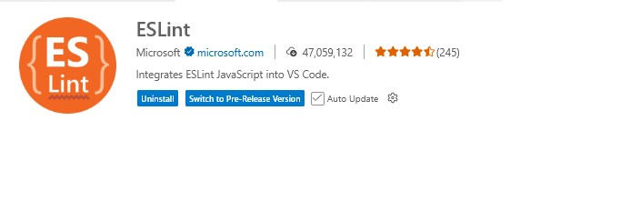

# Documentos web utilizando lenguajes de script de cliente - JavaScript

## 1. Lenguajes de script de cliente

`JavaScript` se utiliza principalmente junto con HTML para crear páginas web interactivas, ya que permite manipular el contenido y el comportamiento de la página en el navegador.


### 1.1. Definición y características
- Lenguajes que se ejecutan en el navegador del usuario.
- Permiten la interacción dinámica con la página web.
- No requieren compilación previa.
**Ejemplo:**
```js
// Un simple script de cliente en JavaScript
alert('¡Hola, mundo!');
```

**Ejercicio:**
- Investiga qué navegadores soportan JavaScript y qué otros lenguajes de script existen actualmente.


### 1.2. Principales lenguajes y estándares
- **JavaScript**: El más utilizado, estándar ECMAScript.
- **TypeScript**: Superset de JavaScript, añade tipado.
- **VBScript**: Usado antiguamente, ahora obsoleto.
- **Otros**: Dart, CoffeeScript (menos comunes).


### 1.3. Versiones y estándares
- ECMAScript (ES5, ES6/ES2015, ES7, ...)
- Compatibilidad entre navegadores.

**Ejemplo:**
```js
// Sintaxis de ES6 (ECMAScript 2015)
let nombre = 'Ana';
const saludo = `Hola, ${nombre}`;
console.log(saludo);
```


## 2. Sintaxis básica de los lenguajes de script de cliente

### Variables y constantes (`var`, `let`, `const` en JavaScript)

**¿Cuándo usar cada una?**
- `var`: Es la forma antigua de declarar variables. Tiene alcance de función (function scope) y puede causar errores por hosting. Se recomienda evitar su uso en código moderno.
- `let`: Se usa para declarar variables cuyo valor puede cambiar. Tiene alcance de bloque (block scope), es más seguro y predecible que `var`.
- `const`: Se usa para declarar constantes, es decir, variables cuyo valor no cambiará. También tiene alcance de bloque. Si intentas reasignar su valor, dará error.

**Resumen:**
Usa `let` para variables que cambian y `const` para valores que no cambian. Evita `var` salvo para mantener código antiguo.
  
- Tipos de datos (números, cadenas, booleanos, objetos, arrays)

### Principales tipos de datos y cómo declararlos

- **Números:**
	```js
	let edad = 25;
	const pi = 3.1416;
	```
- **Cadenas de texto (strings):**
	```js
	let nombre = "Ana";
	const saludo = 'Hola';
	```
- **Booleanos:**
	```js
	let esMayor = true;
	const aprobado = false;
	```
- **Arrays (listas):**
	```js
	let numeros = [1, 2, 3, 4];
	const colores = ["rojo", "verde", "azul"];
	```
- **Objetos:**
	```js
	let persona = { nombre: "Ana", edad: 25 };
	const coche = { marca: "Toyota", modelo: "Corolla" };
	```

**Cómo utilizarlos:**
- Los tipos de datos se asignan automáticamente según el valor.
- Puedes acceder a los elementos de un array con corchetes: `numeros[0]`.
- Puedes acceder a las propiedades de un objeto con punto: `persona.nombre`.
  
### Operadores y expresiones más comunes en JavaScript

- **Aritméticos:**
	- Suma: `+` (ej: `a + b`)
	- Resta: `-` (ej: `a - b`)
	- Multiplicación: `*` (ej: `a * b`)
	- División: `/` (ej: `a / b`)
	- Módulo (resto): `%` (ej: `a % b`)
	- Exponenciación: `**` (ej: `a ** b`)

- **Asignación:**
	- Igual: `=` (ej: `let x = 5`)
	- Suma y asigna: `+=` (ej: `x += 2`)
	- Resta y asigna: `-=` (ej: `x -= 1`)

- **Comparación:**
	- Igualdad: `==` (compara valor), `===` (compara valor y tipo)
	- Desigualdad: `!=`, `!==`
	- Mayor, menor: `>`, `<`, `>=`, `<=`

- **Lógicos:**
	- AND: `&&` (ej: `a && b`)
	- OR: `||` (ej: `a || b`)
	- NOT: `!` (ej: `!a`)

- **Concatenación de cadenas:**
	- Usando `+` (ej: `'Hola ' + nombre`)


**Ejemplo de expresiones:**
```js
let a = 10, b = 3;
let suma = a + b; // 13
let esIgual = (a === b); // false
let texto = "Resultado: " + suma;
let esMayor = (a > b) && (b > 0); // true
```

**Ejercicios para practicar operadores:**
1. Declara dos variables numéricas y muestra por pantalla su suma, resta, multiplicación y división.
2. Crea una variable con tu nombre y otra con tu apellido, y muestra el resultado de unirlas en una sola cadena.
3. Declara una variable con un número y muestra si es mayor o igual que 18 usando un operador de comparación.
4. Declara dos variables booleanas y muestra el resultado de aplicar los operadores lógicos AND, OR y NOT.
5. Escribe una expresión que devuelva true solo si un número es mayor que 10 y menor que 20.

### Estructuras de control (if, for, while, switch)

**if / else:** Permite ejecutar código según una condición.
```js
let edad = 20;
if (edad >= 18) {
	console.log('Eres mayor de edad');
} else {
	console.log('Eres menor de edad');
}
```

**for:** Bucle que repite un bloque de código un número determinado de veces.
```js
for (let i = 0; i < 5; i++) {
	console.log('Iteración número ' + i);
}
```

**while:** Bucle que repite mientras se cumpla una condición.
```js
let contador = 0;
while (contador < 3) {
	console.log('Contador: ' + contador);
	contador++;
}
```

**switch:** Permite ejecutar diferentes bloques de código según el valor de una variable.
```js
let dia = 'lunes';
switch (dia) {
	case 'lunes':
		console.log('Es lunes');
		break;
	case 'martes':
		console.log('Es martes');
		break;
	default:
		console.log('Otro día');
}
```

**Ejercicios para practicar estructuras de control:**
1. Escribe un programa que pida una edad y muestre si es mayor o menor de edad usando if/else.
2. Haz un bucle for que muestre los números del 1 al 10 por pantalla.
3. Utiliza un bucle while para sumar los números del 1 al 5 y muestra el resultado.
4. Crea un switch que, según el valor de una variable "color", muestre un mensaje diferente para "rojo", "azul" o "verde".
5. Escribe un programa que recorra un array de nombres y los muestre uno a uno usando un bucle for.


### Funciones y eventos

**Funciones:** Permiten agrupar código que se puede reutilizar.
```js
function saludar() {
	alert('¡Hola!');
}
saludar(); // Llama a la función y muestra la alerta
```

**Funciones con parámetros:**
```js
function sumar(a, b) {
	return a + b;
}
let resultado = sumar(3, 4); // resultado vale 7
```

**Eventos:** Permiten ejecutar código cuando ocurre una acción (clic, ratón, teclado, etc.).
```html
<button id="miBoton">Haz clic</button>
<script>
	document.getElementById('miBoton').onclick = function() {
		alert('¡Botón pulsado!');
	};
</script>
```

**Ejercicio:**
- Crea una función que reciba un número y devuelva si es par o impar.
- Haz que al pulsar un botón se muestre un mensaje en pantalla usando un evento.


## 3. Selección y acceso a elementos de un documento web

- Acceso mediante **ID**: `document.getElementById('id')`
- Acceso mediante **clase**: `document.getElementsByClassName('clase')`
- Acceso mediante **etiqueta**: `document.getElementsByTagName('tag')`
- Selectores avanzados: `document.querySelector`, `document.querySelectorAll`

**Ejemplo:**
```html
<button id="miBoton">Haz clic</button>
<script>
	const boton = document.getElementById('miBoton');
	boton.addEventListener('click', function() {
		alert('¡Botón pulsado!');
	});
</script>
```

**Ejercicio:**
- Crea una página con varios elementos y accede a ellos usando diferentes métodos de selección.


## 4. Creación y modificación de elementos

- Crear elementos: `document.createElement('tag')`
- Añadir elementos: `parent.appendChild(elemento)`
- Modificar contenido: `elemento.textContent`, `elemento.innerHTML`
- Modificar atributos: `elemento.setAttribute('atributo', 'valor')`

**Ejemplo:**
```js
const nuevoParrafo = document.createElement('p');
nuevoParrafo.textContent = 'Este es un nuevo párrafo.';
document.body.appendChild(nuevoParrafo);
```

**Ejercicio:**
- Haz un script que añada un elemento de lista a un `<ul>` cada vez que pulses un botón.


## 5. Eliminación de elementos de un documento web

- Eliminar un elemento: `elemento.remove()`
- Eliminar desde el padre: `parent.removeChild(elemento)`

**Ejemplo:**
```js
const elemento = document.getElementById('aEliminar');
if (elemento) {
	elemento.remove();
}
```

**Ejercicio:**
- Crea un botón que elimine un elemento específico de la página al pulsarlo.


## 6. Manipulación de estilos de un documento web

- Modificar estilos en línea: `elemento.style.propiedad = 'valor'`
- Añadir/quitar clases: `elemento.classList.add('clase')`, `elemento.classList.remove('clase')`
- Cambiar atributos de estilo mediante JavaScript

**Ejemplo:**
```js
const caja = document.getElementById('caja');
caja.style.backgroundColor = 'yellow';
caja.classList.add('resaltado');
```

**Ejercicio:**
- Haz que al pasar el ratón sobre un elemento, cambie su color de fondo usando JavaScript.


## Extensiones recomendadas para Visual Studio Code

### ¿Cuál es la extensión mínima imprescindible?

Para trabajar con JavaScript en Visual Studio Code, la extensión más importante y mínima es:

- **ESLint**: Analiza y corrige errores de sintaxis y estilo en JavaScript. Es fundamental para evitar errores y mejorar la calidad del código.



Si además quieres ver los cambios en el navegador al guardar, puedes instalar también:
- **Live Server**: Permite lanzar un servidor local y ver los cambios en tiempo real.

Otras extensiones como Prettier o JavaScript (ES6) code snippets son útiles, pero no imprescindibles para empezar.

**¿Cómo instalar una extensión?**
1. Abre Visual Studio Code.
2. Ve a la barra lateral izquierda y haz clic en el icono de extensiones (o pulsa `Ctrl+Shift+X`).
3. Busca el nombre de la extensión y haz clic en "Instalar".

Estas herramientas ayudan a mejorar la calidad, productividad y experiencia al programar en JavaScript para la web.

## Referencias
- [MDN Web Docs - JavaScript](https://developer.mozilla.org/es/docs/Web/JavaScript)
- [ECMAScript Language Specification](https://www.ecma-international.org/publications-and-standards/standards/ecma-262/)
- [W3Schools JavaScript Tutorial](https://www.w3schools.com/js/)
