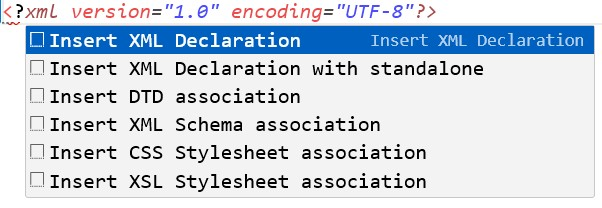
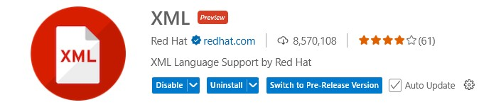

# XML
## Introducción a XML
XML (eXtensible Markup Language) es un lenguaje de marcado que define un conjunto de reglas para la codificación de documentos en un formato que es tanto legible por humanos como por máquinas. Fue desarrollado por el World Wide Web Consortium (W3C) y se utiliza principalmente para almacenar y transportar datos.
XML es bastante autodescriptivo:
```xml
<persona>
    <nombre>Juan Pérez</nombre>
    <edad>30</edad>
    <ciudad>Madrid</ciudad> 
</persona>
```
Pero aún así, el XML anterior no hace nada. XML es sólo información envuelta en las etiquetas.
### Diferencia entre XML y HTML
XML y HTML fueron diseñados con objetivos diferentes:

* XML fue diseñado para llevar datos - con enfoque en qué datos es
* HTML fue diseñado para mostrar datos - con enfoque en cómo se ven los datos
* Las etiquetas XML no están predefinidas como las etiquetas HTML
  
## Cómo se escribe un documento XML: Sintaxis
Un documento XML está formado por una jerarquía de elementos. Veamos punto por punto cómo se escribe un documento XML. 

1. **Declaración XML**: Un documento XML debe comenzar con una declaración XML opcional que especifica la versión de XML y la codificación de caracteres utilizada. La declaración típica es:
```xml
<?xml version="1.0" encoding="UTF-8"?>
```
El atributo *standalone* es opcional y se utiliza para indicar si el documento XML puede funcionar de manera independiente o si requiere información adicional de otro archivo externo (como un DTD o un esquema) para ser interpretado correctamente.

* **standalone="yes"**: Indica que el documento XML **no depende de ningún archivo externo** y puede ser interpretado de manera autónoma. Todos los datos necesarios para la interpretación están contenidos dentro del propio archivo XML.
* **standalone="no"**: Indica que el documento XML depende de un archivo externo, como un DTD o un esquema, para ser interpretado correctamente. El archivo externo proporciona la definición de la estructura y reglas que el XML debe seguir.
```xml
<?xml version="1.0" encoding="UTF-8" standalone="yes"?>
```

2. **Elementos**: Los elementos son los bloques de construcción básicos de un documento XML. Un elemento comienza con una etiqueta de apertura y termina con una etiqueta de cierre. Por ejemplo:
   
```xml
<nombre>Juan Pérez</nombre>
```

3. **Atributos**: Los elementos pueden tener atributos que proporcionan información adicional sobre el elemento. Los atributos se escriben dentro de la etiqueta de apertura del elemento. Por ejemplo:

```xml
<persona edad="30" ciudad="Madrid">
```

4. **Contenido**: El contenido de un elemento puede ser texto, otros elementos o una combinación de ambos. Por ejemplo:

```xml
<persona>
    <nombre>Juan Pérez</nombre>
    <edad>30</edad>
    <ciudad>Madrid</ciudad>
</persona>
```

5. **Elementos anidados**: Los elementos pueden contener otros elementos, creando una estructura jerárquica. Por ejemplo:

```xml
<libros>
    <libro>
        <titulo>Aprendiendo XML</titulo>
        <autor>Juan Pérez</autor>
        <anio>2023</anio>
    </libro>
    <libro>
        <titulo>XML para Todos</titulo>
        <autor>María Gómez</autor>
        <anio>2022</anio>
    </libro>    
</libros>
```

6. **Comentarios**: Puedes agregar comentarios en un documento XML utilizando la siguiente sintaxis:

```xml
<!-- Este es un comentario -->
```

7. **Reglas de sintaxis**:
   - Todos los elementos deben tener una etiqueta de cierre correspondiente.
   - Los nombres de los elementos y atributos son sensibles a mayúsculas y minúsculas.
   - Los nombres de los elementos deben comenzar con una letra o un guion bajo (_), y pueden contener letras, dígitos, guiones (-), puntos (.) y guiones bajos (_).
   - Los atributos deben estar entre comillas dobles ("") o comillas simples ('').
   - Un documento XML debe tener un único elemento raíz que contenga todos los demás elementos.
   - Espacios en blancos y saltos de línea. Detrás del nombre de una etiqueta se permite escribir un espacio en blanco (blank space) o un salto de línea (line break). Por ejemplo, sintácticamente es correcto escribir:

```xml
<nombre >Maria</nombre>
<!-- seria lo mismo escribir -->
<nombre>Maria</nombre>
```

   - Sin embargo, no es correcto escribir:

```xml
< nombre>Maria</nombre>
<!-- ni tampoco -->
<nombre>Maria</ nombre>
```

   - Los espacios en blanco dentro del contenido de un elemento son significativos. Por ejemplo:

```xml
<nombre>  Maria  </nombre>
```
   - En este caso, el contenido del elemento <nombre> incluye los espacios en blanco antes y después de "Maria". Si deseas eliminar esos espacios, debes hacerlo explícitamente.
   - No se permiten caracteres especiales sin escapar. Por ejemplo, los caracteres `<`, `>`, `&`, `'` y `"` deben ser reemplazados por sus entidades correspondientes (`&lt;`, `&gt;`, `&amp;`, `&apos;`, `&quot;`) si se utilizan dentro del contenido de un elemento o atributo.
   - No se permiten etiquetas vacías sin cerrar. Por ejemplo, la siguiente etiqueta es incorrecta:

```xml
<nombre>
```
   - En su lugar, debes cerrarla correctamente:

```xml
<nombre></nombre>
```
   - Alternativamente, puedes usar la sintaxis de etiqueta vacía:

```xml
<nombre/>
```

### Atributo xml:space
El atributo `xml:space` se utiliza para controlar cómo se manejan los espacios en blanco dentro de un elemento XML. Este atributo puede tener dos valores principales: `default` y `preserve`.
- `default`: Indica que los espacios en blanco dentro del elemento pueden ser tratados de manera estándar, lo que significa que **los espacios múltiples pueden ser reducidos a un solo espacio y los espacios al principio y al final del contenido pueden ser eliminados**.
- `preserve`:Indica que los espacios en blanco dentro del valor de texto deben preservarse tal como están, sin eliminación ni reducción. Esto es útil cuando se desea conservar los espacios en blanco significativos en el texto, como en los códigos de programación o los contenidos preformateados.

```xml
<mensaje xml:space="preserve">
    Este    es    un    mensaje    con    espacios    preservados.
</mensaje>
<mensaje xml:space="default">
    Este    es    un    mensaje    con    espacios    no    preservados.
</mensaje>
```
En este ejemplo, el primer elemento <mensaje> conservará todos los espacios en blanco tal como están, mientras que el segundo elemento <mensaje> reducirá los espacios múltiples a un solo espacio y eliminará los espacios al principio y al final del contenido.

### Tabulaciones
Las tabulaciones (tabs) son caracteres especiales que se utilizan para crear espacios en blanco adicionales en el texto. En XML, las tabulaciones se tratan como espacios en blanco y pueden ser utilizadas para mejorar la legibilidad del código XML.
Por ejemplo:

```xml
<libros>
    <libro>
        <titulo>Aprendiendo XML</titulo>
        <autor>Juan Pérez</autor>
        <anio>2023</anio>
    </libro>
    <libro>
        <titulo>XML para Todos</titulo>
        <autor>María Gómez</autor>
        <anio>2022</anio>
    </libro>
</libros>
```
En este ejemplo, las tabulaciones se utilizan para indentar los elementos hijos dentro del elemento raíz <libros>, lo que hace que la estructura del documento sea más clara y fácil de leer.
    
## Cómo se crea un documento XML
Para crear un documento XML, puedes utilizar cualquier **editor de texto plano**, por ejemplo el Bloc de notas de Windows o el editor Nano de Linux, o cualquier editor de código, como Visual Studio Code

### Crear un documento XML en cualquier editor de texto plano
1. Abre tu editor de texto preferido.
2. Crea un nuevo archivo
3. Escribe la declaración XML al comienzo del archivo

```xml
<?xml version="1.0" encoding="UTF-8"?>
```

Esta línea especifica la versión de XML que estás utilizando y la codificación de caracteres.
4. A continuación, puedes comenzar a definir los elementos, atributos y contenido de tu documento XML. Por ejemplo:

```xml
<?xml version="1.0" encoding="UTF-8"?>
<libros>
<libro>
    <titulo>Aprendiendo XML</titulo>
    <autor>Juan Pérez</autor>
    <anio>2023</anio>
</libro>
<libro>
    <titulo>XML para Todos</titulo>
    <autor>María Gómez</autor>
    <anio>2022</anio>
</libro>
</libros>
```

En este ejemplo, hemos creado un elemento raíz <libros> que contiene un elemento hijo <libro>. El elemento <libro> tiene elementos hijos como <titulo>, <autor> y <anio>, que representan los datos de un libro específico.
5. Guarda el archivo con una extensión `.xml`, por ejemplo, «mis_libros.xml».

### Crear un documento XML en Visual Studio Code
Utilizar XML en Visual Studio Code (VS Code) es un proceso bastante sencillo y directo, ya que VS Code ofrece soporte básico para XML de forma predeterminada. Sin embargo, para una experiencia más rica y funcionalidades avanzadas, puedes instalar extensiones adicionales como:
- **XML de Read Hat**: al iniciar la declaración de XML se puede seleccionar la abreviatura correspondiente para que VS Code complete el código, como se puede ver en la siguiente imagen.



- **XML Tools**: Proporciona herramientas para formatear, validar y manipular archivos XML.


1. Algunas funcionalidades:
   
   * **Formatear XML**: Abre un archivo XML y haz clic derecho en el editor. Selecciona «Format Document» o utiliza el atajo Shift+Alt+F. Esto formateará tu XML para que tenga una estructura y sangría adecuadas.
   * **Minificar XML**: Para minimizar tu archivo XML (eliminar espacios y sangrías innecesarias), usa la opción «Minify XML» del menú contextual (Para acceder al menú contextual, selecciona todo el código (Ctrl+A) y haz clic con el botón derecho del ratón sobre el área seleccionada).
   * **Desminificar XML**: Selecciona todo el código (Ctrl+A), haz clic derecho para abrir el menú contextual y elige la opción «Format selection». Esto reorganizará el XML con sangrías y saltos de línea adecuados, haciéndolo más legible.
2. Opciones de configuración
   * XML Tools permite una cierta personalización a través de las opciones de configuración de VS Code. Puedes acceder a estas configuraciones abriendo la paleta de comandos (Ctrl+Shift+P) y buscando «Preferences: Open Settings (JSON)». De esta forma puedes configurar aspectos como la sangría o si se deben cerrar automáticamente las etiquetas, entre otros.

3. Validación y verificación de esquemas:
    * XML Tools puede validar tu archivo XML contra un esquema XML (XSD) si está definido. Esto te ayuda a asegurarte de que tu XML cumple con un estándar específico. Este tema lo veremos más adelante.

:pencil: Realizar actividad 1

## Caracteres especiales en XML
En XML, ciertos caracteres tienen significados especiales y no pueden ser utilizados directamente en el contenido de los elementos o atributos. Estos caracteres especiales son:
1. **Entidades** (entities): Las entidades son secuencias de caracteres que representan símbolos especiales. Comienzan con un ampersand (&), seguido de un nombre o número y terminan con un punto y coma (;). Las entidades son fáciles de leer y entender.
2. **Códigos decimales** (decimal codes): Los códigos decimales son valores numéricos que representan símbolos en la tabla ASCII. Estos códigos se escriben en la forma &#n;, donde «n» es el número decimal correspondiente al símbolo. 
3. **Códigos hexadecimales** (hexadecimal codes): Los códigos hexadecimales son valores numéricos en base 16 que representan símbolos en la tabla ASCII. Los códigos hexadecimales son similares a los códigos decimales, pero utilizan una representación en base 16 en lugar de base 10. Estos códigos se escriben en la forma &#xn;, donde «n» es el valor hexadecimal correspondiente al símbolo.
En la tabla siguiente tienes algunos ejemplos de caracteres especiales en XML y su representación en entidad y referencia en decimal y hexadecimal:

| Carácter | Entidad    | Decimal   | Hexadecimal |
|----------|------------|-----------|-------------|
| «        | &quot;     | &#34;     | &#x22;      |
| &        | &amp;      | &#38;     | &#x26;      |
| ‘        | &apos;     | &#39;     | &#x27;      |
| <        | &lt;       | &#60;     | &#x3C;      |
| >        | &gt;       | &#62;     | &#x3E;      |
| ©        | &copy;     | &#169;    | &#xA9;      |
| €        | &euro;     | &#8364;   | &#x20AC;     |

estas referencias se utilizan para **evitar conflictos con la sintaxis XML** y asegurar que los caracteres especiales sean interpretados correctamente. En el siguiente ejemplo el carácter < se mostrará correctamente en el contenido del elemento sin causar errores en el análisis del documento XML.:

```xml
<mensaje>Este es un ejemplo de uso del carácter &lt; en XML.</mensaje>
```

puedes ver más caracteres y símbolos aquí[ascii.cl/es/codigos-html.htm](https://ascii.cl/es/codigos-html.htm)

## Documentos XML bien formados 
Un documento XML puede ser clasificado en dos categorías principales: bien formado (well-formed) y válido (valid).
1. **Bien formado (Well-formed)**: Un documento XML se considera bien formado si cumple con las reglas básicas de sintaxis de XML. Estas reglas incluyen:
   * El documento contiene únicamente caracteres Unicode válidos.
   * Hay un elemento raíz que contiene al resto de elementos.
   * Los nombres de los elementos y de sus atributos no contienen espacios.
   * El primer carácter de un nombre de elemento o de atributo puede ser una letra, dos puntos (:) o subrayado (_).
   * El resto de los caracteres pueden ser también números, guiones (-) o puntos (.).
   * Los caracteres < y & sólo se utilizan como comienzo de marcas.
   * Las etiquetas de apertura, de cierre y vacías están correctamente anidadas (no se solapan) y no falta ni sobra ninguna etiqueta de apertura o cierre.
   * Las etiquetas de cierre coinciden con las de apertura (incluso en el uso de mayúsculas y minúsculas).
   * Las etiquetas de cierre no contienen atributos.
   * Ninguna etiqueta tiene dos atributos con el mismo nombre.
   * Todos los atributos tienen algún valor.
   * Los valores de los atributos están entre comillas (simples o dobles).
   * No existen referencias en los valores de los atributos.
  
   Un documento bien formado garantiza que pueda ser leído y procesado por cualquier parser XML.
2. **Válido (Valid)**: Un documento XML se considera válido si, además de ser bien formado, cumple con un conjunto específico de reglas definidas por un esquema o DTD (Document Type Definition) lo veremos más adelante.

:pencil: Realizar actividad 2

## Espacios de nombres en XML
Los espacios de nombres (namespaces) en XML son una forma de evitar conflictos de nombres cuando se combinan elementos y atributos de diferentes vocabularios XML. Un espacio de nombres es un identificador único que se utiliza para distinguir entre elementos y atributos que pueden tener el mismo nombre pero pertenecen a diferentes contextos o dominios.
Los espacios de nombres se definen utilizando un URI (Uniform Resource Identifier) que actúa como un identificador único. Aunque los URIs suelen tener la forma de una URL, no es necesario que apunten a un recurso real en la web; simplemente sirven como identificadores únicos.
Para utilizar espacios de nombres en un documento XML, se declara un espacio de nombres en el elemento raíz o en cualquier otro elemento utilizando el atributo `xmlns` (XML Namespace). Por ejemplo:

```xml
<libros xmlns:ficcion="http://www.ejemplo.com/ficcion" xmlns:no-ficcion="http://www.ejemplo.com/no-ficcion">
    <ficcion:libro>
        <ficcion:titulo>El Hobbit</ficcion:titulo>
        <ficcion:autor>J.R.R. Tolkien</ficcion:autor>
    </ficcion:libro>
    <no-ficcion:libro>
        <no-ficcion:titulo>Sapiens</no-ficcion:titulo>
        <no-ficcion:autor>Yuval Noah Harari</no-ficcion:autor>
    </no-ficcion:libro> 
</libros>
```

En este ejemplo, hemos declarado dos espacios de nombres: `ficcion` y `no-ficcion`, cada uno con su propio URI. Los elementos `<libro>`, `<titulo>` y `<autor>` están prefijados con el espacio de nombres correspondiente para indicar a qué vocabulario pertenecen.   
### Prefijos de espacio de nombres
Los prefijos de espacio de nombres son abreviaturas que se utilizan para referirse a un espacio de nombres específico en un documento XML. Estos prefijos se definen en la declaración del espacio de nombres utilizando el atributo `xmlns:prefix`, donde `prefix` es el nombre del prefijo que deseas utilizar.
Por ejemplo, en la siguiente declaración de espacio de nombres:

```xml
<libros xmlns:ficcion="http://www.ejemplo.com/ficcion">
```
Hemos definido el prefijo `ficcion` para el espacio de nombres `http://www.ejemplo.com/ficcion`. A partir de este punto en el documento XML, podemos utilizar el prefijo `ficcion` para referirnos a los elementos que pertenecen a ese espacio de nombres.
Por ejemplo:

```xml
<libros xmlns:ficcion="http://www.ejemplo.com/ficcion">
    <ficcion:libro>
        <ficcion:titulo>El Hobbit</ficcion:titulo>
        <ficcion:autor>J.R.R. Tolkien</ficcion:autor>
    </ficcion:libro>
</libros>
```
En este ejemplo, los elementos `<libro>`, `<titulo>` y `<autor>` están prefijados con el prefijo `ficcion`, lo que indica que pertenecen al espacio de nombres `http://www.ejemplo.com/ficcion`.

### Espacio de nombres predeterminado
Un espacio de nombres predeterminado (default namespace) en XML es un espacio de nombres que se aplica a todos los elementos que no tienen un prefijo específico. Esto significa que cualquier elemento sin prefijo se considera que pertenece al espacio de nombres predeterminado.
Para declarar un espacio de nombres predeterminado, se utiliza el atributo `xmlns` sin un prefijo. Por ejemplo:

```xml
<libros xmlns="http://www.ejemplo.com/ficcion">
    <libro>
        <titulo>El Hobbit</titulo>
        <autor>J.R.R. Tolkien</autor>
    </libro>
</libros>
```

En este ejemplo, hemos declarado un espacio de nombres predeterminado `http://www.ejemplo.com/ficcion`. Todos los elementos dentro del elemento `<libros>` que no tienen un prefijo específico (como `<libro>`, `<titulo>`, y `<autor>`) se consideran que pertenecen a este espacio de nombres predeterminado.
### Mezcla de espacios de nombres
Es posible mezclar espacios de nombres con y sin prefijos en un documento XML. Puedes tener un espacio de nombres predeterminado para ciertos elementos y utilizar prefijos para otros elementos que pertenecen a diferentes espacios de nombres.
Por ejemplo:

```xml
<libros xmlns="http://www.ejemplo.com/ficcion" xmlns:no-ficcion="http://www.ejemplo.com/no-ficcion">
    <libro>
        <titulo>El Hobbit</titulo>
        <autor>J.R.R. Tolkien</autor>
    </libro>
    <no-ficcion:libro>
        <no-ficcion:titulo>Sapiens</no-ficcion:titulo>
        <no-ficcion:autor>Yuval Noah Harari</no-ficcion:autor>
    </no-ficcion:libro>
</libros>
```
En este ejemplo, el espacio de nombres predeterminado `http://www.ejemplo.com/ficcion` se aplica a los elementos `<libro>`, `<titulo>`, y `<autor>`, mientras que el espacio de nombres con prefijo `no-ficcion` se utiliza para los elementos relacionados con libros de no ficción.

:pencil: Realizar actividad 3

## Referencias
* [W3Schools - XML Tutorial](https://www.w3schools.com/xml/)
* [McLibre.org - XML](https://www.mclibre.org/consultar/xml/)